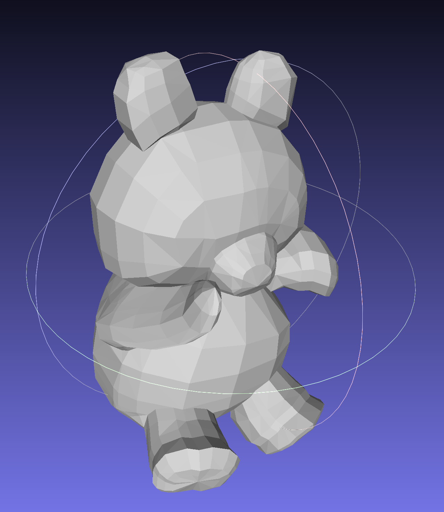

### About
`Surface` is a class for checking orientability, connection, Euler characteristic, volume, mean curvature flow and counting Schlafli formulae.  
`Mesh` is a class to count exterior derivative, wedge and Hodge star of k-forms;
laplacian for functions via weak laplace operator in order to find heat flow and smoothly reconstruct the surface.

### Example

